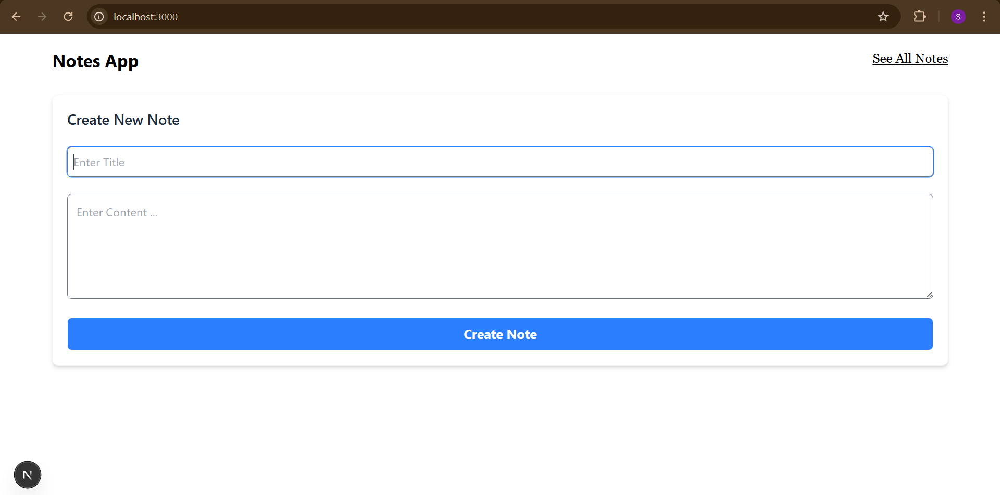
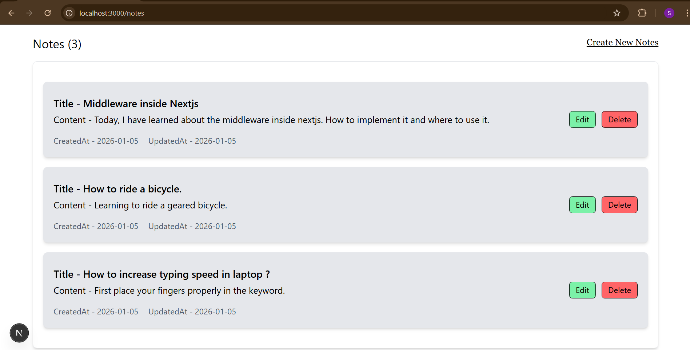
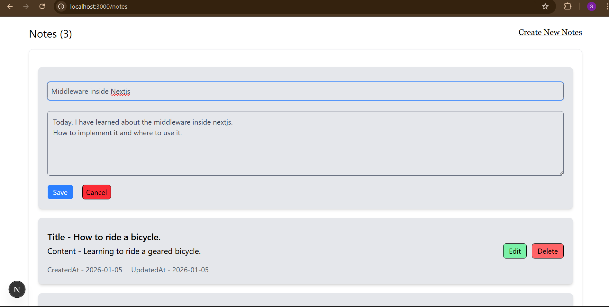

# Notes Taking Application

A full-stack Notes Taking App built with Next.js (App Router) that allows users to create, view, update, and delete notes.
The project uses Next.js API routes as the backend and Prisma ORM for database operations.

## Features

- Create new notes
- View all notes
- Edit existing notes
- Delete notes
- Loading & disabled states for better UX
- Optimistic UI updates
- Displays created and updated dates
- Database persistence using Prisma

## Tech Stack

### Frontend

Next.js 16 (App Router), React, TypeScript, Tailwind CSS.

### Backend

Next.js API Routes (/app/api), Prisma ORM, Database (PostgreSQL)

## API Endpoints

📌 Get all notes

- GET /api/notes

➕ Create a note

- POST /api/notes
- Content-Type: application/json
- Body -{
  "title": "My Note",
  "content": "This is my note"
  }

✏️ Update a note

- PATCH /api/notes/:id
- Content-Type: application/json
- Body - {
  "title": "Updated Title",
  "content": "Updated Content"
  }

🗑️ Delete a note

- DELETE /api/notes/:id

## Installation & Setup

Follow the steps below to run the project locally.

---

### 1️⃣ Clone the Repository

```bash
git clone https://github.com/Shivansh-Pandey-4/notes-app.git
cd notes-app
```

---

### 2️⃣ Install Dependencies

```bash
npm install
# or
yarn install
```

---

## 📸 Screenshots

### 🏠 Home Page – Create Note



### 📄 Notes Page – View All Notes



### ✏️ Edit Note - Edit Any Note


